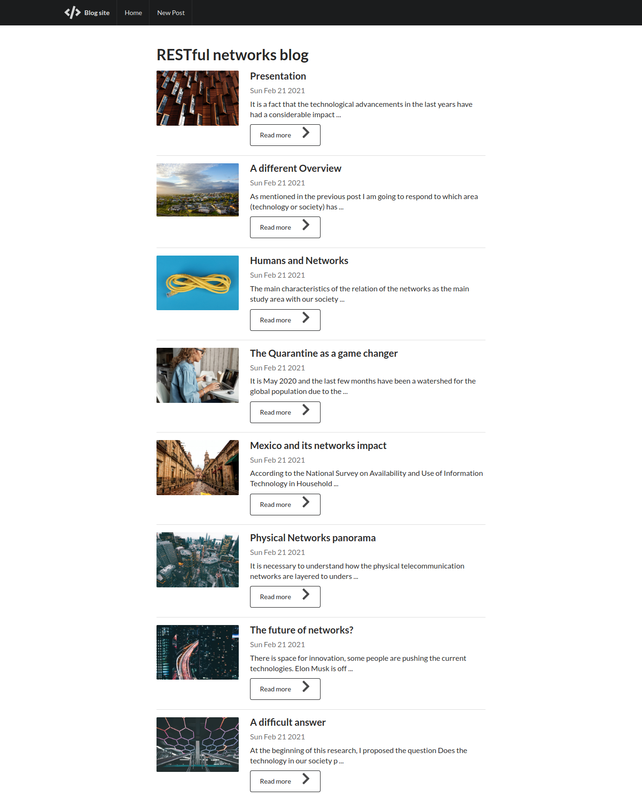

# BlogApp ✍️
Crud web application using the standard RESTful.

<h2 align="center">
  
  
   
</h2>

## Features 💡
⚡️ One Page Layout\
⚡️ Styled with Bootstrap\
⚡️ Restful endpoints implementation\
⚡️ Well organized backend

To view the current webpage, **[click here](https://restful-networks-blog.herokuapp.com/)**

## Technologies used 🛠️
- [MongoDB](https://www.mongodb.com/) - Distributed No relational database 
- [Mongo Atlas](https://www.mongodb.com/cloud/atlas/) - Cloud database service 
- [Express](https://expressjs.com/) - Backend framework for web applications
- [EJS](https://ejs.co/) - Frontend templating engine
- [Bootstrap](https://getbootstrap.com/docs/4.6/getting-started/introduction/) - Front-end open source toolkit\
